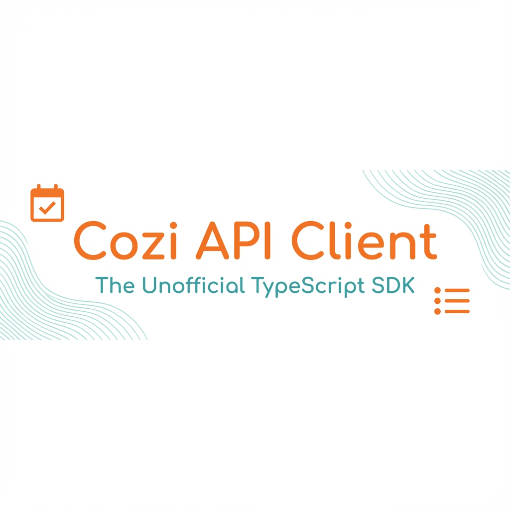

# Cozi API Client



[](https://opensource.org/licenses/MIT)
[](https://www.npmjs.com/package/cozi-api-client)
[](https://github.com/BenHof/cozi-api-client)

Unofficial TypeScript/JavaScript client for the Cozi Family Organizer API.

> ⚠️ **Disclaimer**: This is an **UNOFFICIAL** client library reverse-engineered from the Cozi app traffic. It is not affiliated with, endorsed by, or supported by Cozi/Meredith Corporation. Use at your own risk.

## ✨ Features

Based on the original [BrandCast Cozi Client](https://github.com/BrandCast-Signage/cozi-api-client), this enhanced version adds:

| Feature | Description | Status |
|---------|-------------|--------|
| **🔐 Authentication** | Secure login, session management & persistence | ✅ |
| **📅 Calendar** | Monthly view, appointments, birthdays & holidays | ✅ |
| **📝 Lists** | Shopping & Todo lists with **Sections** support | ✅ |
| **🍳 Recipes** | Create, browse & manage recipes + Curated collections | ✅ |
| **👨‍👩‍👧‍👦 Family** | Manage family members (add/remove/update) | ✅ |
| **🔍 Search** | Full calendar search capability | ✅ |
| **⚙️ Account** | Subscription status, products & config flags | ✅ |
| **🔔 Notifications** | Push token management | ✅ |
| **📐 Types** | 100% Typed with TypeScript | ✅ |
| **🛡️ Robustness** | **100% Test Coverage** (98+ tests) | ✅ |

## 📦 Installation

```bash
npm install cozi-api-client
```

## 💻 CLI Tool

The package includes an interactive CLI tool for quick access to your Cozi data.

```bash
# Run via npx
npx cozi-api-client login
npx cozi-api-client lists
npx cozi-api-client calendar
```

## 🚀 Quick Start

```typescript
import { CoziApiClient } from 'cozi-api-client';

async function main() {
  const client = new CoziApiClient();

  // 1. Authenticate
  await client.authenticate('mom@example.com', 'super-secret-password');

  // 2. Get Today's Agenda
  const calendar = await client.calendar.getCalendar(2026, 1);
  console.log(`Found ${calendar.appointments.length} appointments for January`);

  // 3. Add Item to "Groceries"
  const lists = await client.lists.getLists();
  const groceryList = lists.find(l => l.name === 'Groceries');
  
  if (groceryList) {
    await client.lists.addItem(groceryList.listId, { text: '2 gallons of milk' });
    console.log('Added milk to list!');
  }
}
main();
```

## 📖 API Reference

### 🔐 Authentication Service
Manage user sessions.

```typescript
// Login
const auth = await client.authenticate('email', 'pass');

// Persist session (e.g. to localStorage or DB)
const token = client.getAuthToken();
const accountId = client.getAccountId();

// Restore session later
client.setSessionToken(token, accountId);
```

### 📅 Calendar Service
Full access to the family calendar.

```typescript
// Get monthly view
const jan2026 = await client.calendar.getCalendar(2026, 1);

// Create an appointment
await client.calendar.createAppointment([{
  itemType: 'appointment',
  create: {
    startDay: '2026-02-14',
    startTime: '19:00',
    details: {
      subject: 'Valentine\'s Dinner',
      location: 'Fancy Restaurant'
    }
  }
}]);

// Search calendar
const matches = await client.calendar.search('Doctor');
```

### 📝 List Service
Smart lists with section support.

```typescript
// Get all lists
const allLists = await client.lists.getLists();

// Add a Section Header
await client.lists.addSection(listId, 'Dairy Section');

// Add Item under a section
// Note: Cozi just appends items, UI handles drag-drop ordering for sections
await client.lists.addItem(listId, { text: 'Cheese' });

// Get items organized by section
const sections = await client.lists.getSections(listId);
const dairyItems = await client.lists.getItemsInSection(listId, sections[0].itemId);
```

### 🍳 Recipe Service
Meal planning and recipe management.

```typescript
// Browse user recipes
const recipes = await client.recipes.getRecipes();

// Save a new recipe
await client.recipes.createRecipe({
  name: 'Grandma\'s Cookies',
  ingredients: [
    { name: 'Flour', amount: '2', unit: 'cups' },
    { name: 'Chocolate Chips', amount: '1', unit: 'bag' }
  ],
  instructions: 'Mix and bake at 350°F',
  servings: '24 cookies',
  prepTimeText: '15 mins'
});

// Discover curated recipes
const inspiration = await client.recipes.getCuratedRecipes();
```

### 👨‍👩‍👧‍👦 Family Service
Manage the household.

```typescript
// Get family roster
const family = await client.family.getFamilyMembers();

// Add a child
await client.family.addMember({
  name: 'Timmy',
  accountPersonType: 'attendee', // vs 'member' (login allowed)
  isAdult: false,
  colorIndex: 3 // Color code for calendar
});
```

## 🛠️ Advanced Usage

### Error Handling
The client throws typed `CoziApiError` objects.

```typescript
try {
  await client.authenticate('user', 'wrong-pass');
} catch (err: any) {
  if (err.code === '401') {
    console.error('Login failed: Invalid credentials');
  } else {
    console.error('Cozi API Error:', err.message);
  }
}
```

### Debugging
See exactly what's being sent to Cozi.

```typescript
const client = new CoziApiClient({ 
  debug: true,         // Logs all requests/responses
  userAgent: 'MyApp/1.0' // Custom User-Agent
});
```

## 🤝 Contributing

This is a community project. We welcome contributions!
1. Fork the repo
2. Create your feature branch (`git checkout -b feature/amazing-feature`)
3. Commit your changes (`git commit -m 'Add amazing feature'`)
4. Push to the branch (`git push origin feature/amazing-feature`)
5. Open a Pull Request

## 🙏 Acknowledgments

- **Wetzel402** for the [py-cozi](https://github.com/Wetzel402/py-cozi) library which provided the initial reverse-engineering roadmap.
- **BrandCast** for the original [TypeScript client structure](https://github.com/BrandCast-Signage/cozi-api-client).

## 📄 License

Distributed under the MIT License. See `LICENSE` for more information.

